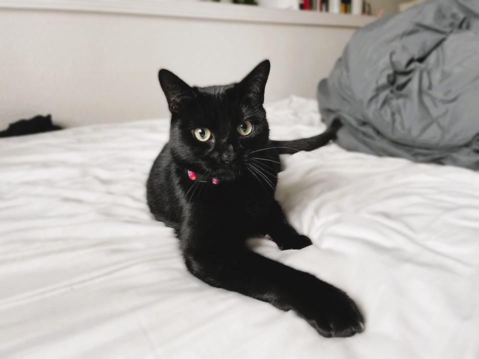

<h3 align="center">👋 Hello! I'm Kevin.</h3>

  <a href="https://kevingil.com">Personal homepage</a> •
  <a href="https://www.threads.net/@kvngil">Threads</a> •
  <a href="https://www.linkedin.com/in/kevingil/">LinkedIn</a>

---

💻 Favorite Tech

  
  
  
 
 

🌱 I’m currently learning:
- Rust

💬 Ask me about: [HTMX](https://htmx.org/)

📫 How to reach me: [in/kevingil](https://www.linkedin.com/in/kevingil/)
   

---

##### ⚡ Here's a photo of my cat:

