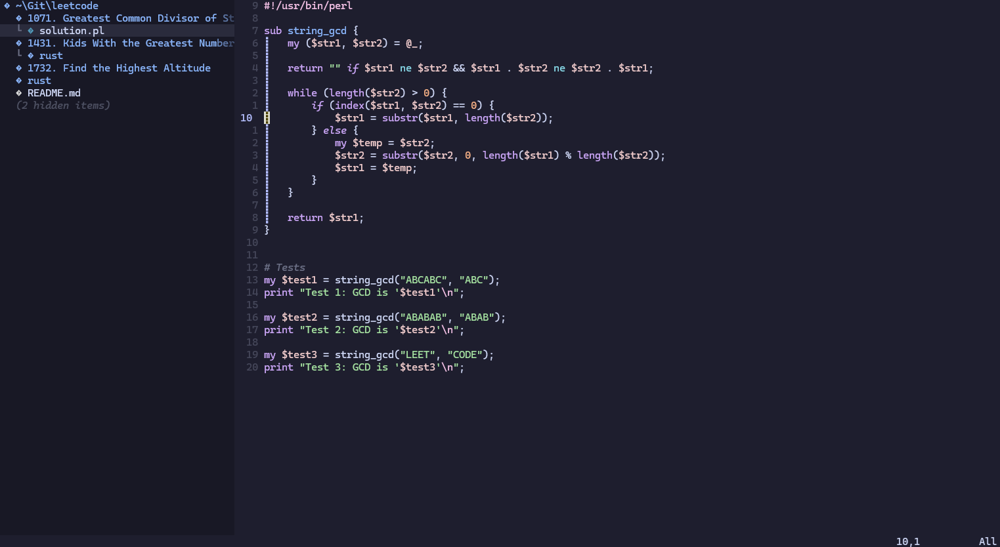

# Neovim Setup

Plugins

```lua
-- plugins/init.lua
"catppuccin/nvim"
"echasnovski/mini.nvim"
"nvim-treesitter/nvim-treesitter"
"hrsh7th/nvim-cmp"
"L3MON4D3/LuaSnip"
"nvim-neo-tree/neo-tree.nvim"
"neovim/nvim-lspconfig"
```



